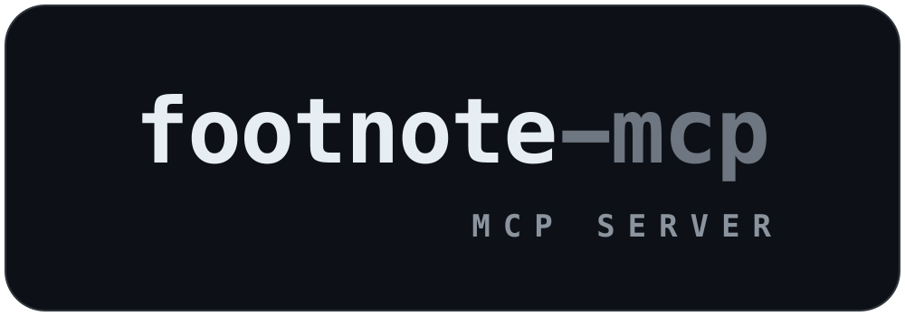

<p align="center">
  
</p>

An MCP server for source-grounded web research. It searches the web, fetches and
extracts pages, pulls structured data out of tables/files/APIs, and — the part that
sets it apart — **verifies that a claim is actually supported by its source** instead of
trusting a snippet. 42 tools over stdio MCP, driven by any MCP client (Claude Desktop,
Cursor) or by the companion [Scholiast](https://github.com/KazKozDev/scholiast) research agent.

The design priority is *trustworthiness over convenience*: search snippets are treated as
discovery only, every fetched page is cached with provenance, and claims are checked
against the source text before they count. It also degrades gracefully — with no API keys
and no config it still works (scraped search + an automatic headless-browser fallback +
an offline verification heuristic); keys and env vars only make it better.

## Quick start

From source (Python ≥ 3.10):

```bash
python3 -m venv .venv && source .venv/bin/activate
pip install -e .                        # installs the `footnote-mcp` console script + deps
python -m playwright install chromium   # the headless browser used by the fetch fallback
footnote-mcp                            # start the server (speaks MCP over stdio)
```

`footnote-mcp` now waits for an MCP client on stdio. Point a client at it by dropping this
into its MCP settings (Claude Desktop: `claude_desktop_config.json`; Cursor: `~/.cursor/mcp.json`):

```json
{
  "mcpServers": {
    "footnote": { "command": "footnote-mcp" }
  }
}
```

No API keys are required to start — search falls back to scraping Bing + DuckDuckGo. Add
keys later under `"env"` (see [Search backends](#search-backends)). Pass `--headed` to watch
the browser tier work.

To run without installing, straight from the source tree:

```bash
PYTHONPATH=src python -m footnote_mcp
```

## Verifying claims — the differentiator

The reason to use this over a plain search tool is `evidence_entailment` and friends:
they tell a claim a source *supports* from one it does not. `benchmarks/run_benchmark.py`
measures that on a labeled set of claim/source pairs (and demos `corroborate_claim` and
`locate_claim_span`):

```bash
python benchmarks/run_benchmark.py                    # offline heuristic (deterministic)
python benchmarks/run_benchmark.py --backend ollama   # LLM judge (needs ollama)
```

Offline-heuristic result on the labeled set ([benchmarks/REPORT.md](benchmarks/REPORT.md)):

| Set | n | Accuracy | Unsupported-claim catch rate | Precision on "supported" |
|-----|---|----------|------------------------------|--------------------------|
| Data domain (numeric + factual) | 15 | 100% | 100% | 100% |
| Overall (incl. semantic) | 18 | 83% | 78% | 80% |

On its design domain — numeric and factual data claims — the offline heuristic never
blesses an unsupported claim and never misses one. Its blind spot is purely-semantic
negation/paraphrase; for those, `evidence_entailment` with `backend="ollama"` (a local LLM
judge) closes the gap. Run the `--backend ollama` line above to score that path on your own
machine.

## Tool surface (42 tools)

<details>
<summary><b>Discovery and reading</b> (9 tools)</summary>

| Tool | Description |
|------|-------------|
| `web_search` | Keyed provider (Tavily/Brave/Google) when available, else scraped Bing + DuckDuckGo. Snippets are discovery only. |
| `web_search_recent` | Search restricted to a recency window (day/week/month/year). |
| `web_deep_search` | Search, fetch, extract, rerank, and return source context. |
| `web_read` | Fetch one URL, extract text, classify source quality, persist cache metadata. |
| `scholarly_search` | Search arXiv (papers) or Wikipedia (encyclopedic) corpora. |
| `web_archive_fetch` | Find the closest Wayback Machine snapshot for a dead/changed URL. |
| `web_fetch_authenticated` | Fetch a page that needs cookies or custom headers. |
| `web_crawl` | Breadth-first crawl from a start URL, on-host by default (≤ 50 pages). |
| `generate_search_queries` | Generate operator queries (`site:`, `filetype:csv`, API/data-table variants). |

</details>

<details>
<summary><b>Structured data</b> (9 tools)</summary>

| Tool | Description |
|------|-------------|
| `web_extract_tables` | Parse HTML tables into `columns`/`rows` with source-URL provenance. |
| `web_detect_downloads` | Detect linked CSV/TSV/XLS/XLSX/PDF/JSON/XML files. |
| `web_parse_file` | Download and parse CSV/TSV/XLS/XLSX/PDF/JSON. |
| `web_fetch_json` | Fetch direct API/JSON endpoints into parsed JSON. |
| `check_date_completeness` | Validate required date coverage (day/week/month). |
| `resolve_units` | Detect currencies, currency pairs, measurement units. |
| `validate_unit_rows` | Reject rows with incompatible units or currency pairs. |
| `reconcile_time_series` | Align series on a key, compute deltas, flag missing keys/outliers. |
| `export_dataset` | Write consolidated rows to a `csv`/`xlsx`/`json` file. |

</details>

<details>
<summary><b>Source quality and verification</b> (8 tools)</summary>

| Tool | Description |
|------|-------------|
| `classify_source` | Classify official / aggregator / blog / forum / interactive / blocked / error. |
| `evidence_entailment` | Strict claim-vs-source checker: `heuristic`, `auto`, `ollama`, optional `local_nli`. |
| `corroborate_claim` | Triangulate a claim across excerpts (corroborated / conflicting / single_source / …). |
| `locate_claim_span` | Locate supporting sentence(s) with char offsets and a containment score. |
| `source_cache_get` / `source_cache_put` | Inspect and write persistent source-cache entries. |
| `build_research_debug_report` | Compact report of queries, URLs, source quality, verification gaps. |
| `startup_health_check` | Check parser, OCR, browser, and cache dependencies. |

</details>

<details>
<summary><b>Controlled extraction recipes</b> (6 tools)</summary>

When generic parsers fail, synthesize a sandboxed parser:

| Tool | Description |
|------|-------------|
| `tool_spec_propose` | Propose a task-specific extraction recipe spec. |
| `tool_code_generate` | Generate a starter `extract(source_text, input_payload)` recipe. |
| `tool_code_validate` | Validate recipe code against a static safety allowlist. |
| `tool_code_run_sandboxed` | Run validated code in a limited subprocess (JSON output only). |
| `tool_promote` | Save a validated recipe as reusable memory (no server edit). |
| `recipe_registry` | Manage promoted recipes: `list` / `get` / `run` / `delete`. |

</details>

<details>
<summary><b>Browser fallback</b> (10 tools)</summary>

A controlled Chromium session for JS-heavy or interactive pages:

| Tool | Description |
|------|-------------|
| `web_navigate` · `web_snapshot` · `web_click` · `web_type` · `web_extract` · `web_scroll` | Drive a page via stable element refs. |
| `browser_set_date_range` · `browser_extract_tables` · `browser_extract_tables_for_date_range` | Set a date range, submit, extract visible tables. |
| `web_screenshot` | Save a PNG and optionally OCR text locked inside the image. |

</details>

## Search backends

`web_search` (and everything built on it) routes through a provider layer. With an API key
it uses that provider; otherwise it scrapes Bing + DuckDuckGo. Results are normalized to one
shape regardless of backend.

| Provider | Env vars | Notes |
|----------|----------|-------|
| Tavily | `TAVILY_API_KEY` | LLM-oriented search API. |
| Brave | `BRAVE_API_KEY` | Independent web index. |
| Google | `GOOGLE_API_KEY` + `GOOGLE_CSE_ID` | Programmable Search (Custom Search JSON API). |
| Bing + DuckDuckGo | none | Default fallback; scraped, no key. |

`auto` (default) tries each keyed provider in order Tavily → Brave → Google, then scrapes.
Force one with the `provider` argument (`tavily`/`brave`/`google`/`scrape`).

**Semantic reranking.** Pass `semantic: true` to `web_search` to reorder by meaning rather
than keyword overlap: it over-fetches, embeds query and results with a local ollama model,
and sorts by cosine similarity (each result gains `semantic_score`). Best-effort — if ollama
is unavailable the original order is returned. Model: `FOOTNOTE_EMBED_MODEL` (default `bge-m3`).

## Fetching & anti-bot ladder

`web_read` fetches through an escalation ladder ([scraper.py](src/footnote_mcp/scraper.py)):
the cheapest method runs first and escalates only when a result looks blocked or empty. A
block/quality detector decides when to escalate; a per-domain rate limiter, circuit breaker,
and negative cache keep it polite. The tier used and the full attempt trace come back in
`fetch_tier` / `scrape_tiers`.

| Tier | Method | Enabled by |
|------|--------|-----------|
| 1 | HTTP (curl_cffi TLS impersonation) | always |
| 2 | HTTP through a rotating proxy | `FOOTNOTE_PROXIES` set |
| 3 | Headless Chromium (runs JavaScript) | `FOOTNOTE_BROWSER_FALLBACK=1` (default on) |
| 4 | Chromium through a proxy | proxies + browser |
| 5 | Hosted scrape API (Firecrawl / ScrapingBee) | `FOOTNOTE_SCRAPE_API` set |

With nothing configured it is the plain HTTP path plus an automatic browser fallback for
JavaScript-rendered pages.

| Env var | Default | Purpose |
|---------|---------|---------|
| `FOOTNOTE_BROWSER_FALLBACK` | `1` | Escalate blocked/JS pages to headless Chromium. |
| `FOOTNOTE_PROXIES` | _(none)_ | Comma-separated proxy URLs; sticky per domain with health tracking. |
| `FOOTNOTE_SCRAPE_API` | _(none)_ | `firecrawl` or `scrapingbee` (needs the matching API key). |
| `FOOTNOTE_DOMAIN_RPS` / `_BURST` | `3` / `5` | Per-domain rate limit (token bucket). |
| `FOOTNOTE_BREAKER_THRESHOLD` / `_COOLDOWN` | `5` / `120` | Per-domain circuit breaker. |
| `FOOTNOTE_NEGCACHE_TTL` | `300` | Seconds to remember a blocked URL. |
| `FOOTNOTE_THIN_CONTENT_CHARS` | `200` | Below this extracted length, a script-heavy page counts as a JS shell. |

## Runtime data

```text
~/.footnote-mcp/source_cache/        # persistent page cache (with provenance)
~/.footnote-mcp/research_memory.json # persistent research memory
```

Override the cache location with `FOOTNOTE_SOURCE_CACHE=/path/to/cache footnote-mcp`.

`check_date_completeness` supports the calendars `calendar`, `business_day`, `crypto_24_7`,
`forex_weekday`, `us_business_day`, and `ru_business_day` (pass explicit `holidays` for
source-specific ones; the `us_`/`ru_` variants use the optional `holidays` package).

## Other install paths

**Docker** bundles Chromium and tesseract — nothing else to install:

```bash
docker build -t footnote-mcp .
docker run -i --rm footnote-mcp        # the client launches this; see MCP config below
```

```json
{ "mcpServers": { "footnote": { "command": "docker", "args": ["run", "-i", "--rm", "footnote-mcp"] } } }
```

**pipx / uvx** (isolated install of the entry point):

```bash
pipx install /path/to/footnote-mcp          # or: pipx install git+<repo-url>
uvx --from /path/to/footnote-mcp footnote-mcp   # ad-hoc, no install
```

**OCR.** PDF/image OCR uses `pytesseract` + the system `tesseract` binary (`brew install
tesseract` on macOS). **Local NLI backend** for `evidence_entailment` `backend="local_nli"`:
`pip install -r requirements-nli.txt` (model via `FOOTNOTE_NLI_MODEL`). Either way,
`startup_health_check` reports what is actually available. Runtime dependency ranges
are declared in `pyproject.toml` and mirrored in `requirements.txt`.

## Tests

```bash
pip install -r requirements-dev.txt
python -m pytest -q          # offline unit + smoke tests; no network or keys needed
```

`tests/test_mcp_smoke.py` launches the server over real MCP stdio and exercises the tools
end to end against a local HTTP fixture; the rest are offline unit tests of the parsers,
fetch ladder, search providers, and dispatch. The live search test is opt-in:

```bash
RUN_LIVE_WEB_TESTS=1 python -m pytest -m live
```

CI runs the same suite (`.github/workflows/tests.yml`).

## License

MIT — see [LICENSE](LICENSE).
